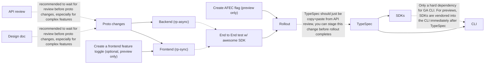

# How to Make a Change to the API

Before you do this, make sure you understand the [API release process](0000-api-version-timelines.md).

## Steps

0. **Understand best practices:** Read the [AKS API Best Practices](../.github/instructions/api-review.instructions.md).

1. **API review:** Go through the [API Review Process](README.md) and get approvals. As part of this process you should have determined which API version your feature is going into.

2. **Design doc review:** Ensure that your design document is reviewed and approved before starting on backend implementation.

3. **HCP/Protobuf (data storage):** Make the HCP/Protobuf changes required to support your feature. Merge this and tag it.
   - Example: [Add Karpenter NodeProvisioningDefaultPoolsMode enum](https://msazure.visualstudio.com/CloudNativeCompute/_git/aks-rp/pullrequest/11889462)
   - In an ideal world your protos would match your API shape relatively closely, so you should wait for initial API feedback before merging the protos.

4. **Create AFEC flag (preview only):** Add the AFEC flag for your feature. See [rp/manifest/features](https://msazure.visualstudio.com/CloudNativeCompute/_git/aks-rp?path=/manifest/README.md&_a=preview&anchor=afec-feature-registration).
   - Note: Once you create the AFEC flag in `rp/manifest/features` and roll it out (which just triggers a Geneva action, so rollout does not take long) users can technically discover the AFEC flag via the CLI

5. **Backend (rp-async, overlaymgr, etc):** Make the backend changes needed to support your feature. These changes will likely be in rp-async or overlaymgr, or possibly both. This is what the service does when your new option(s) are set in the API.
   - Example: [Update OverlayMgr to support Karpenter disabled default pools](https://msazure.visualstudio.com/CloudNativeCompute/_git/aks-rp/pullrequest/11910065?_a=files&path=/overlaymgr/server/helmvalues/addonvalues/karpenter_overlay.go)

6. **Create a frontend feature toggle (optional, preview only):** For large features or features which may need to roll out more slowly than standard SDP, you can create a toggle that can be checked in the rp-sync validator.
   - The toggle is for controlling what region(s) (if any) support this feature. Note that _once you turn the toggle on_, you can't turn it off again as users may have started using the feature and turning the toggle off will break them. The toggle is for one-time feature enablement at rollout and for early testing.
   - This is optional. Some features may not have a toggle blocking feature enablement at the frontend.
   - **DO NOT** leave this toggle disabled for months after you merge the TypeSpec.

7. **Frontend (rp-sync):** Make the frontend changes in validation and datamodel to accept the new field, validate it, and set it in the proto model.
   - If making a preview API change, make sure to check your AFEC flag _and_ toggle if you created it, with logic like:
     ```text
     if toggle off, reject with error like ".properties.myPreviewField is not available in this region"
     ...
     if afec off, reject with error like ".properties.myPreviewField cannot be enabled without first enabling feature 'MyFeaturePreview', see aka.ms/aks/<somelink> for more details."
     ```
   - It is **strongly** recommended that you write an `integration_test.go` style test for your feature that confirms the happy-path. See more about validators and testing at [Validation Best Practices](https://msazure.visualstudio.com/CloudNativeCompute/_wiki/wikis/CloudNativeCompute.wiki/580711/Validation-Best-Practices).
   - Example: [Add nodeProvisioningProfile.defaultNodePools field](https://msazure.visualstudio.com/CloudNativeCompute/_git/aks-rp/pullrequest/11910684)
   - The datamodel (located at [resourceprovider/server/microsoft.com/containerservice/datamodel/<version>](https://msazure.visualstudio.com/CloudNativeCompute/_git/aks-rp?path=/resourceprovider/server/microsoft.com/containerservice/datamodel/v20260202preview)) _must_ match exactly (including case) the TypeSpec from the API review.

8. **End to end test w/ internal Swagger (optional but strongly recommended):** The AKS RP repo hosts an internal copy of the generated Swagger spec (those may move to TypeSpec one day). It is located at [rp/swagger](https://msazure.visualstudio.com/CloudNativeCompute/_git/aks-rp?path=/swagger/README.md).
   - Updating this is _only_ for the "Awesome SDK", which is the SDK used by AKS E2E (E2Ev2, E2Ev3, etc). Update this Swagger if you need the ability to E2E test your API, which you should probably be doing.

9. **Rollout**: Your rp-sync, rp-async, overlaymgr, etc changes must roll out to production. For changes in overlaymgr and AKS RP this is done for you by the official release process. See [API release process](0000-api-version-timelines.md) for timelines. Note that the timelines for availability in CLI are significantly different between preview (fast) and GA (slow) releases.

10. **TypeSpec:** Make the TypeSpec changes in the [public GitHub repo](https://github.com/Azure/azure-rest-api-specs/tree/main/specification/containerservice/resource-manager/Microsoft.ContainerService/aks). The TypeSpec branch availability will be posted in the **AKS API channel** on Teams.
   - It is expected that you only merge the TypeSpec changes to the public GitHub _when the change is available for users_.
   - **Do not** merge TypeSpec changes whose APIs/fields cannot be called by users. _Some flexibility_ is allowed here if the feature will be enabled via toggle
   before the next TypeSpec release (usually in a month). If it will be multiple months, wait for a TypeSpec release closer to when your feature will actually 
   be available for users.

11. **SDKs:** These are automatically published after the TypeSpec merges. There is nothing required by AKS engineers to publish the SDKs, though sometimes a wait is required depending on the SDK teams release cadence. See the [API release process](0000-api-version-timelines.md) for more details.

12. **CLI:** If the changes are for the GA CLI, you must wait for the Python SDK to publish first. If the changes are for the preview CLI, Fuming vendors the SDK updates directly into the CLI immediately, so you can start on this right after the TypeSpec merges.

### Working flowchart

The above list outlines the sequence of PR merges. In reality, you can work on some steps in parallel to avoid being blocked while waiting on previous steps to be reviewed and/or merged. Keep in mind that while doing this is generally good, **if you don't have approvals/confidence in the API shape or design and you start implementation, you may end up throwing away work**. For that reason, it is advised to front-load at least initial API and design review.



#### Legend

- solid line: required dependency
- dotted line: recommended dependency

## Tips

- You can use `go mod replace` to replace the protos locally and do development of **step 3: HCP/Protobuf (data storage)**, **step 5: Backend (rp-async, overlaymgr, etc):**, and **Step 7: Frontend (rp-sync)** all in the same branch. Recommend you keep the commits separate for each of them though as you'll have to break them out into 3 separate PRs to merge.
