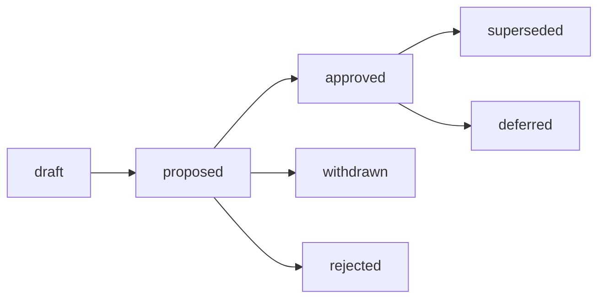

# What

A Request For Discussion (RFD) is a document describing an issue and proposing solutions or solciting discussion.

Participants reach consensus on RFDs by the process defined in this document.

Participants may use RFDs to iterate on the RFD process itself.

# Why

A large and distributed organization needs ways to document and discuss problems and changes in an organized way.

Today, we use a combination of wiki, meetings/recordings, and office docs.

RFDs seek to codify the record of discussions, reasoning, and decicions.

# Details

Many organizations have some form of discussion, comment, or proposal process.

Some examples online:
- https://oxide.computer/blog/rfd-1-requests-for-discussion/
- https://google.aip.dev/
- https://github.com/gravitational/teleport/blob/master/rfd/0000-rfds.md
- https://www.rfc-editor.org/rfc/rfc1543
- https://github.com/rust-lang/rfcs/blob/master/README.md
- https://github.com/kubernetes/enhancements/blob/master/keps/sig-architecture/0000-kep-process/README.md
- https://peps.python.org/pep-0001/

## Process

We aim to keep things light and iterate.

Each RFD must summarize its motivation and intent. The "why" and "what" (not necessarily in that order).

TODO: who approves RFDs? leads, some new group?

## RFD State

Each RFD starts life in the "draft" state.

An author may open a PR updating an RFD's state to "proposed" to invite discussion.

An author may withdraw an RFD before approval, changing its state to "withdrawn". 

Approvers may reject an RFD, changing its state to "rejected".

Approved RFDs without activity may be marked "deferred" at editors discretion (TODO: who are editors?).

Approved RFDs may be superseded by later RFDs. 

Supersedence should be indicated in both documents.

TODO: do we merge drafts for posterity? changelogs?

